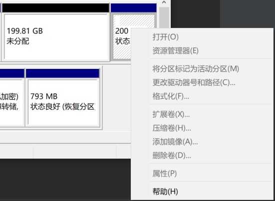
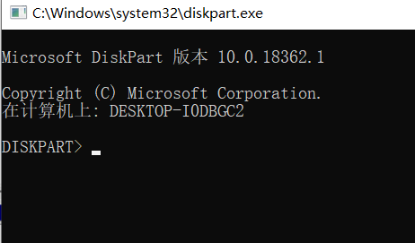
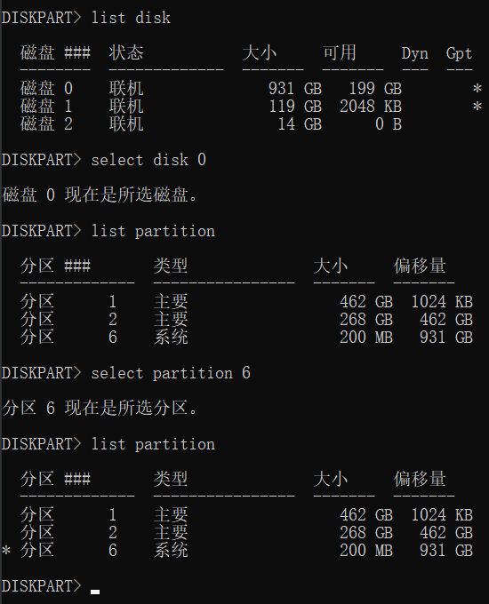
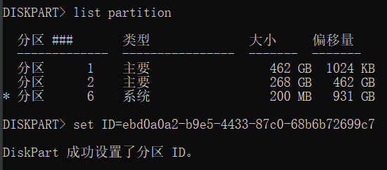
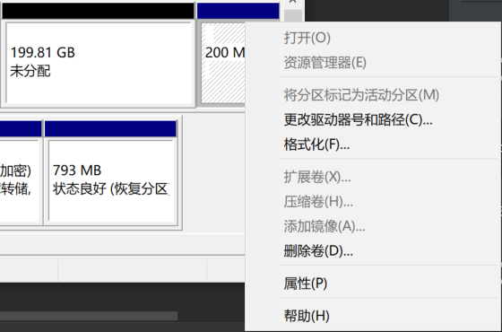

# Can not Remove partition in Windows

## 1.Can not delete partition



## 2.Open `Diskpart` in `CMD`



## 3.Select your *disk* and *partition*

 
 
 ## 4.Change `ID` of this partition


 
```
set ID=ebd0a0a2-b9e5-4433-87c0-68b6b72699c7
```


ID Refer:[Example in Microsoft DOCS](https://docs.microsoft.com/en-us/windows-server/administration/windows-commands/set-id)

## 5.Delete partition successfully

